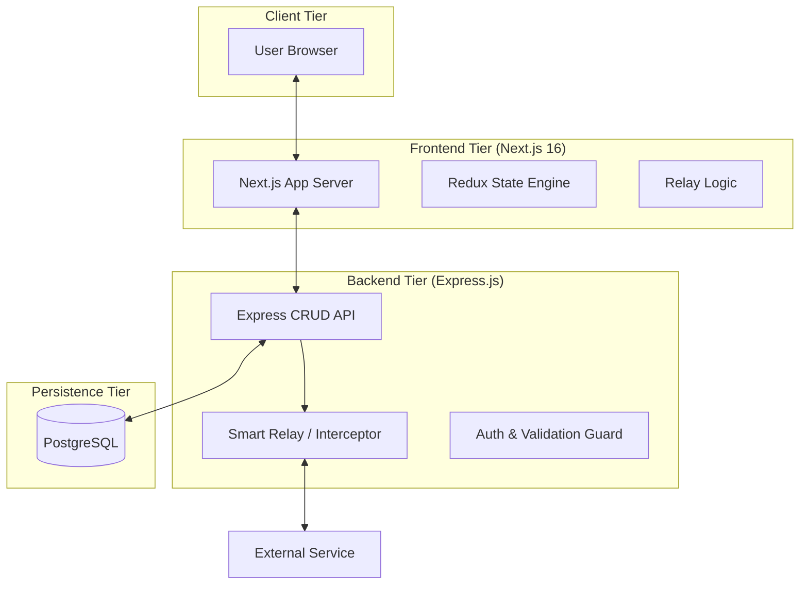

# 🏗️ Architecture Design: FluxPort 2.0

**FluxPort 2.0** is an enterprise-oriented API Gateway and collaboration system. This document outlines the technical design, data flows, and architectural principles that power the platform.

## 🧱 High-Level Overview

---

## ⚡ Key Architectural Components

### 🔄 The Smart Relay (Proxy Engine)
The core of FluxPort is the **Smart Relay Proxy**. Unlike a simple proxy, our engine allows for "Request Interception".
- **Interception Logic**: Before forwarding a request, the engine checks for `InterceptorRules`.
- **Transformation**: Dynamically modifies headers, query parameters, or body payloads based on rules.
- **Audit**: Every request/response cycle is asynchronously logged to the `ApiLog` table for real-time analytics.

### 🏢 Workspace Isolation & Multi-Tenancy
We use a **Workspace-Centric Data Model**.
- Every object (`Collection`, `Folder`, `SavedRequest`) belongs to a `Workspace`.
- Access is strictly governed by the `workspace_members` table and the `status` of membership.
- **Security Guard**: Express middleware verifies the `userId` in the JWT against the `workspace_id` for every request.

### 🧬 Data Schema Strategy
Our PostgreSQL schema is designed for speed and traceability:
- **`collections`**: Root unit for API projects.
- **`folders`**: Recursive logical grouping for requests.
- **`saved_requests`**: Stores full request metadata (headers, body, auth, etc.).
- **`api_logs`**: Time-series request history for audit trails.

---

## 🚦 Data Flow Example: Saving a Request

1. **Frontend**: The user clicks "Save" in the Request Builder.
2. **Redux**: Validates the request data in the central state.
3. **Dispatch**: Sends a `POST` request to `/api/saved-requests`.
4. **Auth Guard**: Middleware verifies the JWT and workspace permissions.
5. **Validation**: `express-validator` checks the request body schema.
6. **DB Transaction**: The repository writes the new entry to PostgreSQL.
7. **Broadcast**: (Optional) Socket.io broadcasts the update to other workspace members.

---

## 🐳 Deployment & Scaling
We emphasize **Container-First** architecture.
- **Production Isolation**: Next.js uses `standalone` output mode to minimize Node.js image footprints.
- **Database Scalability**: Designed for connection pooling and row-level security for high-concurrency environments.

---

  Generated for the FluxPort Engineering Team. 🚦

