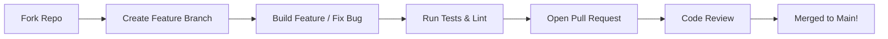

# 🤝 Contributing to FluxPort 2.0

First of all, thank you for considering contributing to **FluxPort 2.0**! It is people like you who make the open-source community such an amazing place to learn, inspire, and create.

## 🏗️ Contribution Workflow

Follow this guide to get your contribution merged smoothly:



---

## 🛠️ Local Development Setup

We recommend using **Docker** for the fastest setup. However, for a native setup:

1. **Fork and Clone**:
   ```bash
   git clone https://github.com/priyanshuKumar56/FluxPort.git
   cd FluxPort
   ```
2. **Setup Submodules**:
   - The project uses a root Next.js app and an `/server` Express app.
   - Install dependencies in both root and `/server`: `npm install`.

3. **Environment**: 
   - Copy `.env.example` to `.env` in both the root and `/server` folders.

---

## 📐 Coding Standards

### 🧬 Git Branching
- `feature/name-of-feature` for new functionality.
- `fix/name-of-bug` for bug fixes.
- `docs/what-changed` for documentation updates.

### ✍️ Commit Messages
We follow **Conventional Commits**:
- `feat: [description]` for new features.
- `fix: [description]` for bug fixes.
- `chore: [description]` for maintenance tasks.
- `docs: [description]` for documentation only.

### 🛠️ Code Quality
Before pushing, ensure these steps pass:
```bash
# Automated formatting
npm run format

# Static analysis
npm run lint

# Unit & Integration tests
npm run test
```

---

## 🐞 Issues & Bug Reports
We use GitHub Issues to track bugs and enhancement requests. If you find a problem:
1. Check if the issue [already exists](https://github.com/priyanshuKumar56/FluxPort/issues).
2. If not, open a new issue using the **Bug Report** template.
3. Be as descriptive as possible (include screenshots and environment details).

---

## 📝 Pull Request Process
1. Ensure your code follows the existing style guidelines.
2. Link your PR to the issue it resolves (e.g., `Closes #123`).
3. Add tests for new functionality.
4. Your PR must pass all CI/CD checks before it will be reviewed.

---

## 📜 Code of Conduct
By participating, you agree to abide by our [Code of Conduct](CODE_OF_CONDUCT.md).

Happy coding! 🚀
