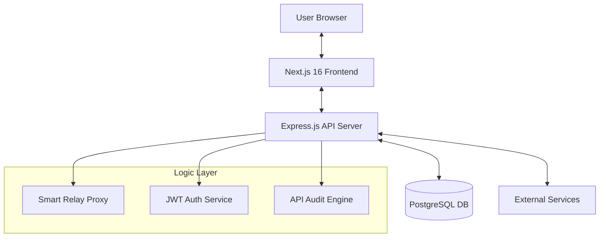

# 🛡️ FluxPort 2.0

<div align="center">


[](https://opensource.org/licenses/MIT)
[](https://nextjs.org/)
[](https://expressjs.com/)
[](https://www.docker.com/)

**The Enterprise-Grade API Gateway & Collaboration Suite**

[Explore Documentation](#-documentation) • [Report Bug](https://github.com/priyanshuKumar56/FluxPort/issues) • [Request Feature](https://github.com/priyanshuKumar56/FluxPort/issues)

</div>

---

## 📖 Table of Contents
- [Overview](#-overview)
- [System Architecture](#-system-architecture)
- [Key Features](#-key-features)
- [Tech Stack](#-tech-stack)
- [Quick Start](#-quick-start)
- [Development Workflow](#-development-workflow)
- [Contributing](#-contributing)
- [Security](#-security)

---

## ⚡ Overview
**FluxPort 2.0** is an advanced API Gateway and developer collaboration platform. Built for modern engineering teams, it provides a unified hub for designing, testing, and monitoring APIs with built-in workspace management and real-time insights.

Whether you're debugging a local service or managing enterprise-scale integrations, FluxPort provides the tooling to streamline your API lifecycle.

---

## 🏗️ System Architecture



---

## 🌟 Key Features

| Feature | Description |
| :--- | :--- |
| **🚀 Smart Relay Proxy** | Intercept and forward requests with dynamic rule-based routing. |
| **📁 Collection Management** | Organize your API requests into nested folders and logical collections. |
| **🔐 Workspace Isolation** | Secure, multi-tenant workspace system for team collaboration. |
| **📊 Real-time Monitoring** | Live API logs and detailed request/response analytics. |
| **🎭 Interceptor Rules** | Deep request manipulation using per-endpoint interceptor logic. |
| **🛠️ Request Builder** | Full-featured UI for building and testing REST/GraphQL endpoints. |

---

## 🛠️ Tech Stack

### Frontend
- **Framework**: Next.js 16 (Standalone Output)
- **State**: Redux Toolkit & React Hooks
- **UI Architecture**: Radix UI & Tailwind CSS
- **Animations**: Framer Motion & GSAP
- **Testing**: Vitest & React Testing Library

### Backend
- **Runtime**: Node.js 20+
- **Framework**: Express.js
- **Database**: PostgreSQL (Neon/Self-hosted)
- **Security**: JWT, Helmet, & Express-Validator
- **Testing**: Vitest & Supertest

---

## 🚀 Quick Start

### 🐳 The Docker Way (Recommended)
The fastest way to get FluxPort running locally is using Docker Compose.

```bash
docker-compose up --build
```
*Access the dashboard at `http://localhost:3000`*

### 🛠️ Manual Installation

1. **Prerequisites**: Node.js 20+ and PostgreSQL.
2. **Backend**:
   ```bash
   cd server && npm install
   # Create .env based on the template
   npm run dev
   ```
3. **Frontend**:
   ```bash
   npm install
   # Create .env.local
   npm run dev
   ```

---

## 🧪 Development Workflow

We maintain high standards for code quality. Every contribution must pass:

```bash
# Formatter check
npm run format

# Static analysis
npm run lint

# Unit & Integration tests
npm run test
```

---

## 🤝 Contributing
We love contributors! Please see our [CONTRIBUTING.md](CONTRIBUTING.md) for details on our code of conduct and the process for submitting pull requests.

---

## 🛡️ Security
Security is our top priority. If you discover a vulnerability, please refer to our [SECURITY.md](SECURITY.md).

---

<p align="center">
  Built with ❤️ for developers, by developers.
</p>
